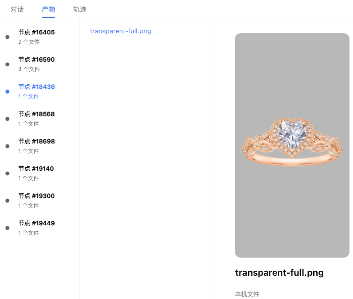

# DSH 产物预览

[`English`](./README.en.md)

`dsh-product-preview` 为 DSH 对话增加类似访达分栏视图，用于浏览本地生成的媒体产物。



插件会读取成功的工具结果和助手文本，发现其中的图片、视频与 SVGA 绝对路径，并将每个文件归入最先报告该路径的对话节点。界面保留原始目录与文件名。只有位于 `allowedRoots` 下且仍存在的文件，才能获得短时有效的同源预览地址。

此 bundle 不依赖特定产品或 Bot。Desktop 宿主可选地通过 `/api/product-preview/actions` 提供原生操作，例如打开、在访达中显示和右键菜单。

## 配置

```yaml
- id: product-preview
  name: dsh-product-preview
  config:
    allowedRoots:
      - /absolute/path/to/your/output-directory
```

支持 PNG、JPEG、WebP、GIF、MP4、MOV、WebM、M4V 与 SVGA。本包内置 `svga.lite`，因此安装后预览 SVGA 不需要再从网络下载播放器。

## 开发

使用 Node.js 22 或更新版本，以及通过 Corepack 启用的 pnpm：

```sh
corepack pnpm install
corepack pnpm run typecheck
corepack pnpm test
corepack pnpm run package
```

`pnpm-workspace.yaml` 中的开发期 override 会将固定的 DSH alpha 包链接到同级 `dsh-desktop` 检出目录中的运行时。这些 override 不会进入打包后的插件 manifest；DSH Profile 仍会按 `package.json` 中声明的版本解析依赖。
